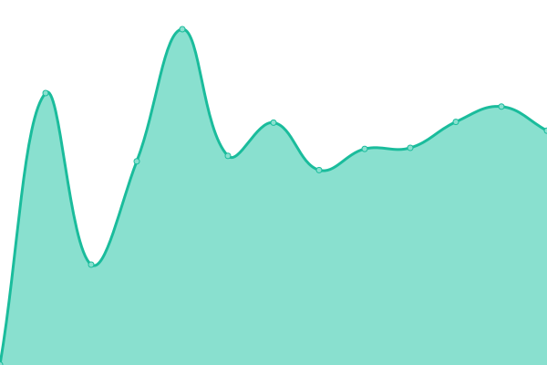
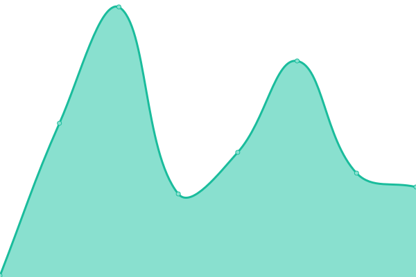
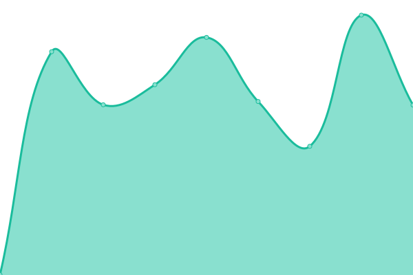
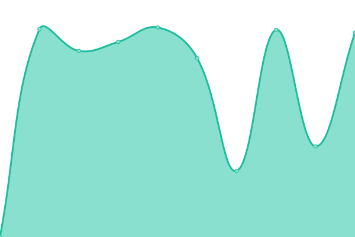
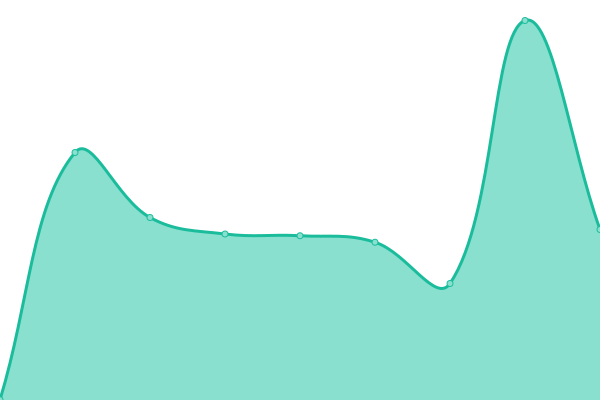
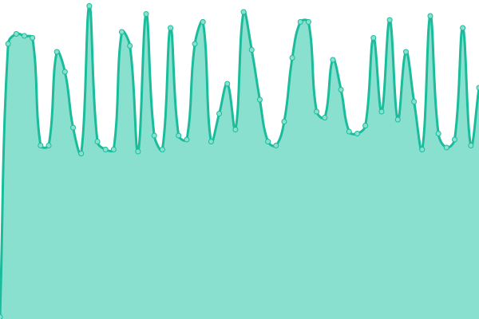

# [📈 Live Status](https://theyosh.github.io/upptime): <!--live status--> **🟧 Partial outage**

This repository contains the open-source uptime monitor and status page for [TheYOSH](https://theyosh.nl), powered by [Upptime](https://github.com/upptime/upptime).

With [Upptime](https://upptime.js.org), you can get your own unlimited and free uptime monitor and status page, powered entirely by a GitHub repository. We use [Issues](https://github.com/theyosh/upptime/issues) as incident reports, [Actions](https://github.com/theyosh/upptime/actions) as uptime monitors, and [Pages](https://theyosh.github.io/upptime) for the status page.

<!--start: status pages-->
<!-- This summary is generated by Upptime (https://github.com/upptime/upptime) -->
<!-- Do not edit this manually, your changes will be overwritten -->
<!-- prettier-ignore -->
| URL | Status | History | Response Time | Uptime |
| --- | ------ | ------- | ------------- | ------ |
|  [TheYOSH.nl](https://theyosh.nl) | 🟩 Up | [the-yosh-nl.yml](https://github.com/theyosh/upptime/commits/HEAD/history/the-yosh-nl.yml) | 

 978ms
     
 | 

<a href="https://theyosh.github.io/upptime/history/the-yosh-nl">100.00%</a>
    

|  [TerrariumPI](https://terrarium.theyosh.nl) | 🟩 Up | [terrarium-pi.yml](https://github.com/theyosh/upptime/commits/HEAD/history/terrarium-pi.yml) | 

 1008ms
     
 | 

<a href="https://theyosh.github.io/upptime/history/terrarium-pi">63.14%</a>
    

|  [TerrariumPI Documentation](https://theyosh.github.io/TerrariumPI/) | 🟩 Up | [terrarium-pi-documentation.yml](https://github.com/theyosh/upptime/commits/HEAD/history/terrarium-pi-documentation.yml) | 

 133ms
     
 | 

<a href="https://theyosh.github.io/upptime/history/terrarium-pi-documentation">100.00%</a>
    

|  [Matrix server](https://matrix.theyosh.nl) | 🟩 Up | [matrix-server.yml](https://github.com/theyosh/upptime/commits/HEAD/history/matrix-server.yml) | 

 1096ms
     
 | 

<a href="https://theyosh.github.io/upptime/history/matrix-server">100.00%</a>
    

|  [Mastodon server](https://mastodon.theyosh.nl) | 🟩 Up | [mastodon-server.yml](https://github.com/theyosh/upptime/commits/HEAD/history/mastodon-server.yml) | 

 862ms
     
 | 

<a href="https://theyosh.github.io/upptime/history/mastodon-server">100.00%</a>
    

|  [Cloud server](https://cloud.theyosh.nl) | 🟩 Up | [cloud-server.yml](https://github.com/theyosh/upptime/commits/HEAD/history/cloud-server.yml) | 

 979ms
     
 | 

<a href="https://theyosh.github.io/upptime/history/cloud-server">100.00%</a>
    

|  [Weblate server](https://weblate.theyosh.nl) | 🟩 Up | [weblate-server.yml](https://github.com/theyosh/upptime/commits/HEAD/history/weblate-server.yml) | 

 932ms
     
 | 

<a href="https://theyosh.github.io/upptime/history/weblate-server">100.00%</a>
    

|  [Storj server](storj.theyosh.nl) | 🟩 Up | [storj-server.yml](https://github.com/theyosh/upptime/commits/HEAD/history/storj-server.yml) | 

 144ms
     
 | 

<a href="https://theyosh.github.io/upptime/history/storj-server">100.00%</a>
    

|  [Imap server](mail.theyosh.nl) | 🟩 Up | [imap-server.yml](https://github.com/theyosh/upptime/commits/HEAD/history/imap-server.yml) | 

 113ms
     
 | 

<a href="https://theyosh.github.io/upptime/history/imap-server">99.81%</a>
    

|  [Mail1.theyosh.nl](mail1.theyosh.nl) | 🟩 Up | [mail1-theyosh-nl.yml](https://github.com/theyosh/upptime/commits/HEAD/history/mail1-theyosh-nl.yml) | 

 156ms
     
 | 

<a href="https://theyosh.github.io/upptime/history/mail1-theyosh-nl">100.00%</a>
    

|  [Mail2.theyosh.nl](mail2.theyosh.nl) | 🟩 Up | [mail2-theyosh-nl.yml](https://github.com/theyosh/upptime/commits/HEAD/history/mail2-theyosh-nl.yml) | 

 126ms
     
 | 

<a href="https://theyosh.github.io/upptime/history/mail2-theyosh-nl">93.90%</a>
    

|  [Mail3.theyosh.nl](mail3.theyosh.nl) | 🟥 Down | [mail3-theyosh-nl.yml](https://github.com/theyosh/upptime/commits/HEAD/history/mail3-theyosh-nl.yml) | 

 0ms
     
 | 

<a href="https://theyosh.github.io/upptime/history/mail3-theyosh-nl">0.00%</a>
    

<!--end: status pages-->

[**Visit our status website →**](https://theyosh.github.io/upptime)

## 📄 License

- Powered by: [Upptime](https://github.com/upptime/upptime)
- Code: [MIT](./LICENSE) © [Anand Chowdhary](https://anandchowdhary.com), supported by [Pabio](https://pabio.com)
- Data in the `./history` directory: [Open Database License](https://opendatacommons.org/licenses/odbl/1-0/)
